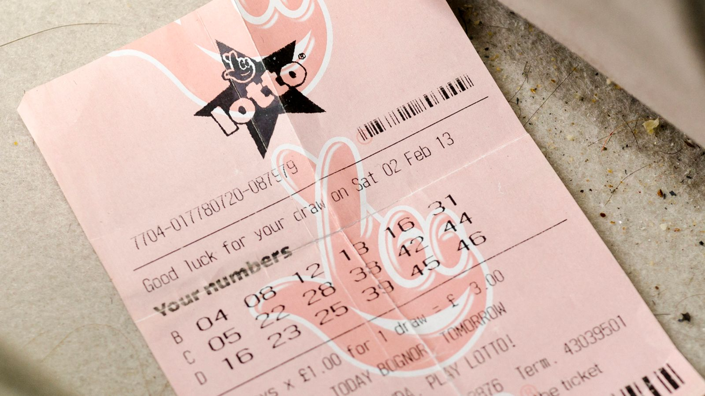

# Combinatrix
Combinatorics is a branch of mathematics that deals with the study of discrete structures and the enumeration of arrangements and selections. Combinatorics is concerned with counting and arranging objects or events, which has applications in computer science, cryptography, probability, statistics, and various other areas. In network theory, combinatorics helps in analyzing connectivity, paths, and cycles in graphs. 

Combinatrix is a simple Python library that provides functions to calculate the number of permutations and combinations of a set of items. With Combinatrix, you can now effortlessly calculate the number of ways to arrange or select items from a set of choices in your Python projects. 

[](https://www.python.org/)
[](https://opensource.org/licenses/MIT)


## Usage
Combinatrix contains a single function called `calc_permutations_combinations`, which takes the number of possible choices, the number of choices to make, and an optional flag to allow repetitions, and returns the number of combinations and permutations.


#### Parameters:
- `number_of_possible_choices` (int): Total number of possible choices.
- `number_of_choices_to_make` (int): Number of choices to make.
- `allow_repetitions` (bool, optional): If `True`, repetition of a choice is allowed. Defaults to `True`.

#### Returns:
- (tuple): A tuple containing two integers - (combinations, permutations).


## Permutations and Combinations

### Permutations

A permutation is an arrangement of items in a specific order i.e., represents the number of ways we can select `r` items from a set of `n` items when repetitions are not allowed. The formula to calculate permutations is:

```
nPr = n! / (n - r)!
```

where `n` is the total number of items, `r` is the number of items to select, and `!` represents the factorial function.


### Combinations

A combination, on the other hand, represents the number of ways we can select `r` items from a set of `n` items when repetitions are allowed. The formula to calculate combinations is:

```
nCr = (n + r - 1)! / (r! * (n - 1)!)
```

where `n` is the total number of items, `r` is the number of items to select, and `!` represents the factorial function.





## License
Combinatrix is distributed under the MIT License. See the [LICENSE](LICENSE) file for more details.

## Contributions
Contributions to Combinatrix are welcome! If you encounter any issues or have suggestions for improvements, please open an issue or a pull request on the [GitHub repository](https://github.com/adillwma/combinatrix).

---
